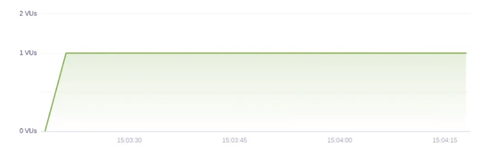
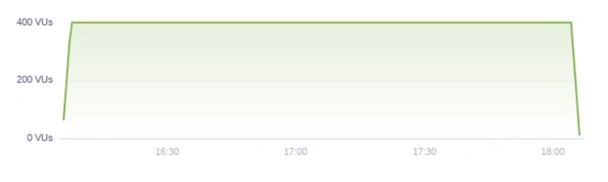
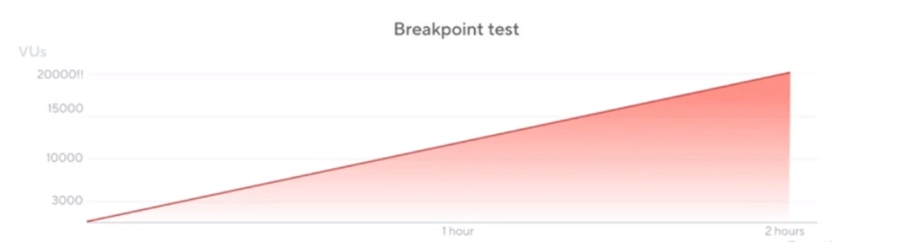

# Diferentes tipos de testes

- [Smoke testing](Smoke-testing)
- [Load testing](Load-testing)
- [Stress testing](Stress-testing)
  - [Spike testing](Spike-testing)
- [Soak/Endurance testing](Soak/Endurance-testing)
- [Breakpoint testing](Breakpoint-testing)

---

## Smoke testing

Visa validar o mínimo funcionamento após uma modificação

Busca validar:

1. Carga mínima:
   - O mínimo possível de usuários que deve utilizar a plataforma. Exemplo: 1 virtual user
2. Cenário simples
3. Funcionalidade core
4. Rápido resultado

### Exemplo

```
export const options = {
  vus: 1,
  duration: '1m',
};
```



---

## Load testing

Busca obter uma avaliação do desempenho da aplicação em termos de usuários simultâneos e requisições simultâneas

Busca validar:

1. Quantidade de tráfego
2. Condições normais e de pico
3. Garantir funcionamento

Estágios do teste de carga

1. Ramp up
   - Aplica uma subida de carga gradual até alcançar a quantidade de usuários desejada
2. Carga constante
   - Aplica uma carga constante
3. Ramp down
   - Aplica a descida de carga até alcançar o mínimo de usuários desejado

> Os testes de carga permitem que o sistema aqueça ou redimensione automaticamente para lidar com o tráfego, além de que permite a comparação de tempo de resposta entre os estágios de carga baixa e carga nominal.

### Exemplo

```
// Carga constante
export const options1 = {
  vus: 100,
  duration: '20m',
};

// Carga variável
export const options2 = {
  stages: [
    { duration: '5m', target: 100 },
    { duration: '10m', target: 100 },
    { duration: '5m', target: 0 },
  ]
};
```


---

## Stress testing

Busca responder como o sistema se comportará sob alta carga de usuários

Busca validar:

1. Disponibilidade
2. Estabilidade
3. Recuperabilidade

Quatro perguntas devem ser respondidas ao realizar um stress testing:

1. Como seu sistema se comporta em condições extremas?
2. Qual é a capacidade máxima do seu sistema em termos de usuários ou taxa de transferência?
3. Qual o ponto de ruptura do seu sistema?
4. O sistema se recupera sem intervenção manual após o término do teste de estresse?

> O stress testing também pode ser usado para validar a arquitetura em que o projeto foi construído, buscando identificar gargalos ou problemas na arquitetura utilizada

> É comum realizar testes de estresse em períodos pré black friday

O auto dimensionamento do stress testing pode validar

1. A rapidez com que os mecanismos de dimensionamento automático reagem ao aumento da carga
2. Se houve alguma falha durante os eventos de dimensionamento

### Spike testing

A diferença principal para o Spike testing é que não é utilizada carga gradual. É como se simulasse um aumento repentino de carga, em frações de segundos.

Duas perguntas devem ser respondidas ao realizar um stress testing:

1. Como seu sistema funcionará sob um aumento repentino de tráfego?
2. O seu sistema irá se recuperar assim que o tráfego diminuir?

Ao realizar um Spike test, o sistema pode reagir de quatro maneiras

1. Excelente
   - O retorno funciona da mesma maneira que com carga baixa
2. Bom
   - O sistema é capaz de dar conta sem apresentar grandes problemas
3. Insatisfatório
   - O sistema apresenta problemas durante o pico de usuários, mas volta ao normal quando o tráfego diminui
4. Ruim
   - O sistema trava e não se recupera quando o tráfego diminui

### Exemplo

```
export const options = {
  stages: [
    { duration: '2m', target: 100 },
    { duration: '5m', target: 100 },
    { duration: '2m', target: 200 },
    { duration: '5m', target: 200 },
    { duration: '2m', target: 300 },
    { duration: '5m', target: 300 },
    { duration: '2m', target: 400 },
    { duration: '5m', target: 400 },
    { duration: '10m', target: 0 },
  ]
};
```

---

## Soak/Endurance testing

No Soak testing, nos preocupamos com a confiabilidade do sistema durante um longo período de tempo, simulando dias de tráfego em poucas horas.

Busca validar:

1. O sistema não sofre de bugs ou vazamentos de memória
2. Se as reinicializações inesperadas do aplicativo não perdem solicitações
3. Encontrar bugs relacionados a condições de corrida que aparecem esporadicamente

Além disso, o Soak testing busca:

1. Certificar que o seu banco de dados não esgote o espaço de armazenamento alocado e pare
2. Certificar de que os logs não esgotam o armazenamento em disco alocado
3. Certificar de que os serviços externos dos quais você depende não parem de funcionar após a execução de uma certa quantidade de solicitações

> Não busca alcançar o ponto de ruptura do sistema, então é importante ter em mente a quantidade de usuários a ser utilizada e os requisitos de infraestrutura. Também é importante ter noção se esse teste realmente faz sentido para o projeto

### Exemplo

```
export const options = {
  stages: [
    { duration: '2m', target: 400 },
    { duration: '3h56m', target: 400 },
    { duration: '2m', target: 0 },
  ]
};
```



---

## Breakpoint testing

Também conhecido como teste de carga pontual, busca validar e descobrir os limites do seu sistema

Precisamos saber os limites do nosso sistema para:

1. Ajustar/Cuidar de pontos fracos do sistema, buscando limites maiores suportados pelo sistema
2. Ajudar a planejar e verificar a correção de sistema com baixo limite de utilização

Quando executar:

1. Após mudanças significativas na base de código/infraestrutura
2. Consumo elevado de recursos pelo seu sistema
3. Carga do sistema cresce continuamente

Considerações antes da realização do teste

1. Atenção a elasticidade de ambientes de nuvem
2. Aumento de carga gradual para essa modalidade
3. Tipo de teste de ciclo iterativo
4. Interrupção manual ou automática

### Exemplo

```
export const options = {
  executor: 'ramping-arrival-rate',
  stages: [
    { duration: '2h', target: 20000 },
  ]
};
```


